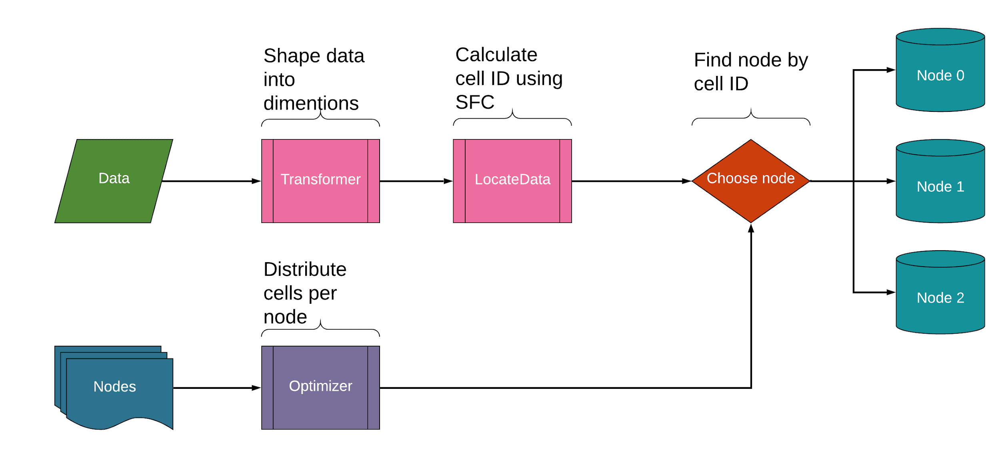
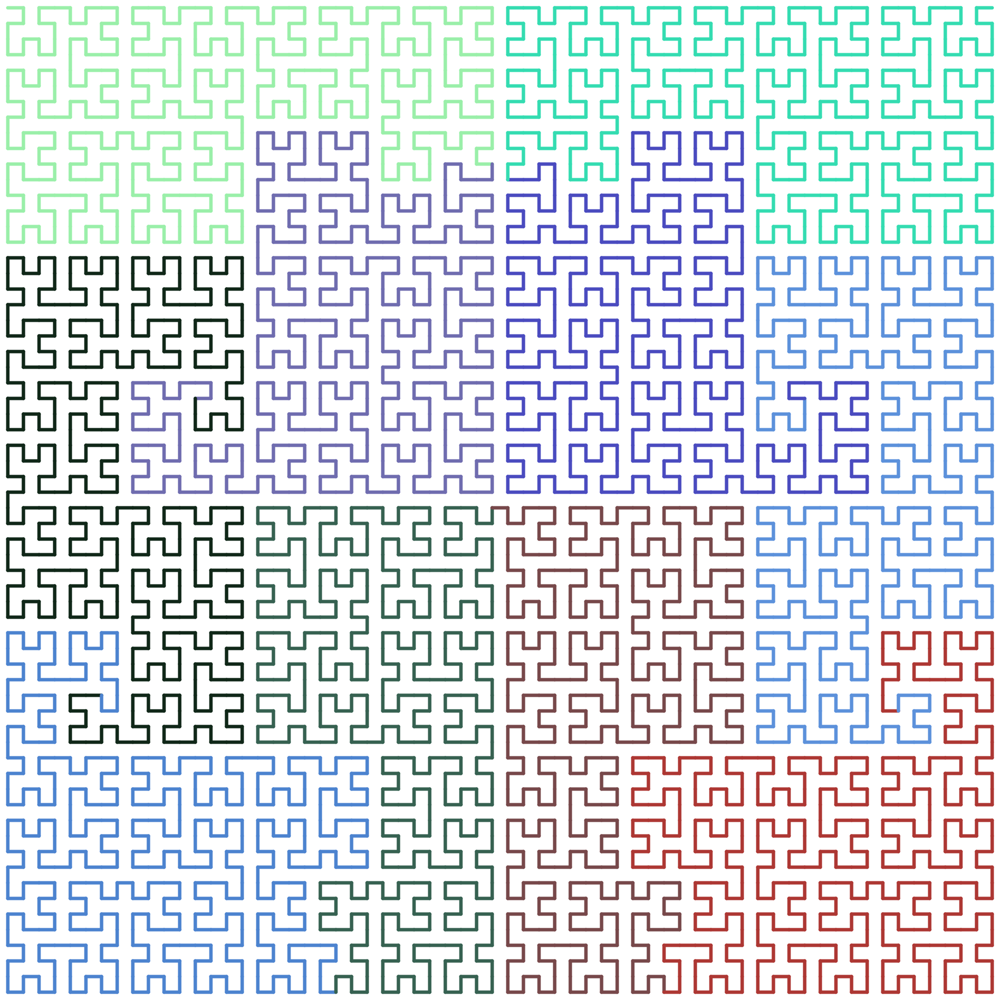
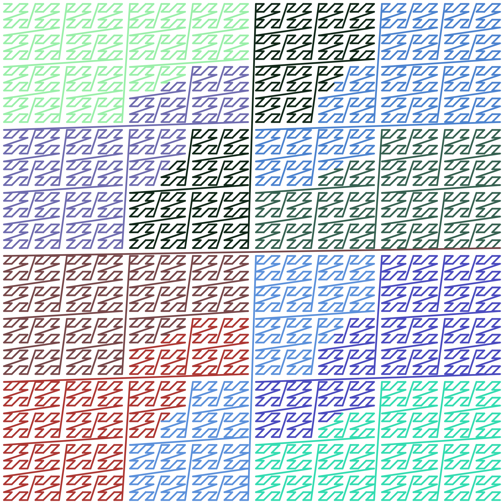

[](https://goreportcard.com/report/github.com/struckoff/sfcframework)

Library provides hashing mechanism which use space filling curve as core algorithm for locating data between multiple nodes.
This approach provides high data locality and distribution based on data and nodes features.

# Architecture


# Configuration
Balancer is configurable by those parameters:
 + [curve type](#curves)
 + amount of dimensions
 + size of each dimension
 + [transform function](#transform)
 + [optimizer](#optimizer)
## Curves
Library provides implementation of Hilbert and morton curves.
Curve is able to encode arbitrary number of dimensions.
The number of dimensions to work with should be configured on curve creation. 
### Hilbert curve

### Morton curve


## Transform
TransformFunc is an adapter which purpose to convert values into encodable format.
````go
type TransformFunc func(values []interface{}, sfc curve.Curve) ([]uint64, error)
````
## Optimizer
Optimizer is a function which responsible for dividing curve into cell groups.
This function should contain realisation of an algorithm of distribution cell ranges per node.
````go
type OptimizerFunc func(s *Space) ([]*CellGroup, error)
````

# Example
````go
package main

import (
	"fmt"

	balancer "github.com/struckoff/sfcframework"
	"github.com/struckoff/sfcframework/curve"
	"github.com/struckoff/sfcframework/node"
	"github.com/struckoff/sfcframework/optimizer"
	"github.com/struckoff/sfcframework/transform"
)

func main() {
	n := MyNode("node-0")
	d := MyDataItem("di-id")

	b, err := balancer.NewBalancer(curve.Morton, 2, 64, transform.SpaceTransform, optimizer.PowerRangeOptimizer, nil)
	if err != nil {
		panic(err)
	}

	err = b.AddNode(&n, true)
	if err != nil {
		panic(err)
	}

	nn, cID, err := b.AddData(&d)
	if err != nil {
		panic(err)
	}

	fmt.Println(nn.ID(), cID)
}

type P float64

func (p *P) Get() float64 {
	return float64(*p)
}

type C float64

func (c *C) Get() (float64, error) {
	return float64(*c), nil
}

type MyNode string

func (n *MyNode) ID() string {
	return string(*n)
}
func (n *MyNode) Hash() uint64 {
	return 1
}

func (n *MyNode) Capacity() node.Capacity {
	c := C(1000.0)
	return &c
}

func (n *MyNode) Power() node.Power {
	p := P(42.42)
	return &p
}

type MyDataItem string

func (d *MyDataItem) Values() []interface{} {
	return []interface{}{1.0, 2.0}
}

func (d *MyDataItem) ID() string {
	return string(*d)
}

func (d *MyDataItem) Size() uint64 {
	return 42
}
````
